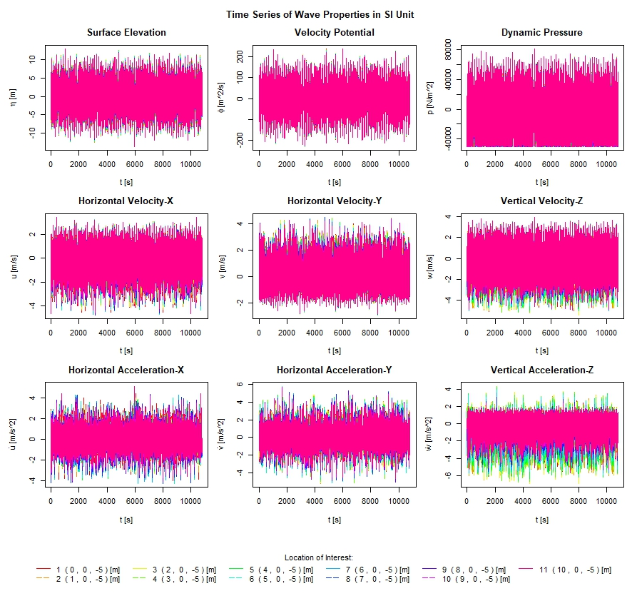

```{r, include = FALSE}
knitr::opts_chunk$set(
  collapse = TRUE,
  comment = "#>"
)
```

```{r setup}
library(DWS)
```

## Introduction

Real ocean waves are irregular and multi-directional. An irregular ocean wave field can be intuitively viewed as the superposition of many monochromatic wave components with different amplitudes, frequencies and directions, in other words, represented by a directional wave spectrum. Current engineering practices use *Linear Wave Theory (LWT)*, in particular linear spectral methods to estimate irregular wave properties. Linear (Gaussian) random wave model describes the irregular wave field as the linear superposition of free wave components, whose wavelength and period obey the *dispersion relation*, and ignores the *nonlinear interaction* among them. High frequency contamination is often cited *(Forristall 1985, Lo & Dean 1986)* as perhaps the major error source in prediction of wave crest kinematics from linear superposition. Because the solution domain of the linear wave model above *Mean Water Level (MWL)*, an irrational extrapolation of the linear wave model above MWL may greatly overestimate the kinematics of high frequency wave components near the wave crest. For structures at the free surface, the waves above the MWL may have a large influence on the response of the structure and may not be ignored. If linear wave theory is used, then the theory is modified to account for the *free-surface effect*. There are several possible modifications that have been proposed, such as *Wheeler’s stretching (1970)* and *linear extrapolation*. *Wheeler’s stretching* is most commonly used in the offshore structure design.

The *R* Package *DWS (Directional Wave Simulation)* numerically simulates the time series of the irregular waves at different locations in the ocean based upon a directional wave energy spectrum. Based upon the input of a 2-dimensional table with energy spectral variance versus wave frequencies and wave direction angles and linear wave theory, *DWS* calculates the time histories of the surface elevation, the horizontal velocity, the vertical velocity, the horizontal acceleration, the vertical acceleration, and the dynamic pressure at different locations $(x, y, z)$ coordinates.

In calculating the irregular waves, two different models for the wave redirection could be chosen to combine a variety of harmonic wave components, one is *Single Summation Model (SSM)* and the other is *Double Summation Model (DSM)*. For SSM, wave components of different frequencies travel in different directions, but at the same frequency, they travel in the same direction. For DSM, at the same frequency, wave components travel in different directions (energy spreading). 

In obtaining the harmonic wave components, the *Linear Wave Theory (LWT)* is employed to calculating the properties of the regular waves. As we know, the linear wave theory can only be applied up to the still water level. However, for structures at the free surface, the waves above the *Still Water Level (SWL)* may have a large influence on the response of the structure and may not be ignored. If linear theory is used, the theory is modified to account for the *Free Surface Effect*. There are several possible modifications that have been proposed, such as *First-Order Stretching*, *Linear Extrapolation*, and *Second Order Stretching*. *Wheeler’s stretching (1970)* is the most used *First-Order Stretching* technique in the offshore structure design. Thus, only Linear Wave Theory without stretching and with Wheeler’s stretching are provided in the *R* Package *DWS*.

## Linear Directional Waves Simulation

### Governing Equations for Surface Gravity Water Waves

Assume the flow is incompressible and irrotational over uniformly flat and impermeable ocean bottom, and the pressure is constant at the free surface. The Cartesian coordinate $(x, y, z)$ are fixed in space with the $x$-axis and $z$-axis pointing to the direction of wave propagation and upwards, respectively. $z = 0$ is located at the still water surface, and $h$ is the constant water depth. The governing equations for the flow in the $(x, y, z)$ coordinates are as follows:

$$
\triangledown^2 \Phi = 0, \ \ \ \ \ -h < z < \eta,
$$

$$
\frac{\partial \Phi}{\partial z} = 0, \ \ \ \ \ z = -h,
$$

$$
\frac{\partial \Phi}{\partial t} + g \eta + \frac{1}{2} \left |\triangledown \Phi  \right |^2 = C(t), \ \ \ \ \ z = \eta,
$$

$$
\frac{\partial \Phi}{\partial z} - \frac{\partial \eta}{\partial t} - \triangledown_h \Phi \cdot \triangledown_h \eta = 0, \ \ \ \ \ z = \eta.
$$

where $\Phi$ and $\eta$ are respectively the total wave potential and total elevation of a periodic wave train, $C(t)$ the Bernoulli constant which will be properly chosen to ensure that $z = 0$ located at the still water level and $g$ the gravitational acceleration. The notations $\triangledown$ and $\triangledown_h$ stand for the gradient and horizontal gradient operators, respectively.

Assume small wave steepness, that is, the amplitude of a wave train is much smaller than its length, then the free surface boundary conditions can be linearized as follows

$$
\frac{\partial \Phi}{\partial t} + g \eta = C(t), \ \ \ \ \ z = 0,
$$

$$
\frac{\partial \Phi}{\partial z} - \frac{\partial \eta}{\partial t} = 0, \ \ \ \ \ z = 0.
$$

The linear solution for the potential of a periodic wave train can be derived using the variable separation method, and the corresponding solution for wave elevation can be obtained as follows

$$
\Phi =  \frac {a g} {\sigma} \frac {\cosh [ k (z + h)]} {\cosh k h} \sin \theta
$$

$$
\eta = a \cos \theta
$$

where the Bernoulli constant $C(t) = 0$, the phase function $\theta = k_n (\cos \chi x + \sin \chi y ) - \sigma t + \beta$, $k$ denotes the magnitude of wave number vector ($\vec{k} = \triangledown_h \theta$), $\chi$ the direction of the wave train with respect to the $x$-direction, and $\beta$ the randomly selected initial phase. The wave number $k$ and frequency $\sigma$ are related through the linear dispersion relation:

$$
\sigma^2 = g k \tanh  k h
$$

where $h$ is the water depth of the flat ocean bottom

## Workflow and Theoretical Formulations

The detailed workflow and theoretical formulations for the *R* Package *DWS* are presented as follows:

### 1. Read in the parameters and data for the directional wave energy spectrum from the input file ‘spectrum.txt’ or alternatively lazy load 'Katrina' data:

#### Directional Wave Spectrum

The irregular directional ocean waves can be represented by a directional wave energy spectrum or energy density spectrum. The directional wave energy spectrum describes the energy content of an ocean wave and its distribution over a frequency range and a direction range of the random wave. A real directional wave energy spectrum recorded during Hurricane Katrina is shown in Table 1 and Fig 1. In the design of a nonlinear offshore system, the time history of the ocean wave is required to carry out the time domain analysis. The time history is computed from the directional wave energy spectrum. Based on a frequency band of width $\Delta \sigma$ and an increment of the wave spreading angle $\Delta \chi$, the amplitude of each regular wave component is derived from the formula as follows:

$$
a_{ij} = \sqrt{2S(\sigma_i,\ \chi_{j}) \Delta \sigma_i \Delta \chi_{j}}
$$

where $S(\sigma_i,\ \chi_j)$ is the wave energy spectral density at the frequency $\sigma_i$ in the direction $\chi_j$, $E(\sigma_i,\chi_j) = S(\sigma_i,\chi_j) \cdot \Delta \sigma_i \cdot  \Delta \chi_j$ the energy spectral variance at the frequency $\sigma_i$  in the direction  $\chi_j$, which is provided in the Table 1. Note that the index $i$ indicates the $i$-th frequency and $j$ the m-th direction at the $j$-th frequency.


{width=100%}


           h:  Water depth of a specific area where the directional wave energy spectrum is obtained.
         xyz:  (x, y, z) Coordinate Matrix for Locations of Interest, m.
           t:  Time Series, sec.
           n:  Number of frequencies in the directional wave energy spectrum.
           m:  Number of directions in the directional wave energy spectrum.
     freq(i):  Frequency Vector σ_i in the directional wave energy spectrum, Hz.
     kata(j):  Direction Vector χ_j in the directional wave energy spectrum, deg.
     spevar(i, j):  Spectral Variance E(i,j) in the directional wave energy spectrum，m^2/Hz/deg.
    dfreq(i):  Frequency Bend Width Δσ_i in the directional wave energy spectrum
    dkata(j):  Direction Bend Width Δχ_j in the directional wave energy spectrum
       iunit:	 Identifier for Unit System: 1 for SI Unit, 2 for English Unit.

### 2. Convert the units for the frequencies and the directions

*Wave Frequency*: From Natural Frequency (Hz) to Circular Frequency (rad/s)

$$
f_n (Hz) \Rightarrow \sigma_n = 2 \pi f_n \Rightarrow  \sigma_n (rad/s)
$$
*Wave Direction*: From (deg) to (rad)

$$
\chi_m (deg) \Rightarrow if \ \chi_m > 180 ^{\circ},\ then \ \chi_m = \chi_m - 360 ^{\circ} \Rightarrow \chi_m = \chi_m \cdot \pi /180^{\circ} \Rightarrow \chi_m (rad)
$$

### 3. Calculate Wave Number $k_n$ in Function wavnum 

      iseed:	Initial large, odd integer for generating randomly selected initial phases.
        tol:	Acceptance tolerance of convergence test for Newton-Raphson Method in calculating Wave Number k_n.
         no:	Maximum number of iterations for Newton-Raphson Method in calculating Wave Number k_n.

#### Theoretical Formulations for Newton-Raphson Method:

##### Linear Wave Dispersion Relation:

$$
\sigma^2 = g k \tanh  k h
$$

$$
f(k) = \sigma^2 - g k \tanh k h
$$

$$
{f}'(k) = - g \left (\tanh k h +  \frac{k h} {{\cosh}^2 k h }  \right )
$$

$$
k_i = k_{i-1} - \frac {f(k_{i-1})} {{f}'(k_{i-1})}
$$

##### Initial guess of $k_0$:

Assume deep water, we have:

$$
\sigma^2 = g k \Rightarrow k = \frac {\sigma^2} {g} \Rightarrow L = \frac {2 \pi} {k} = \frac{2 \pi g}{\sigma^2}
$$

If $h / L ≥ 1/2$, Deep water, $k = k_0$;

Else if $h / L ≤ 1/20$, Shallow water, $k_0 = \sqrt{\sigma^2 / g h}$;

Else $1/20 < h / L < 1/2$, Intermediate water, $k_0 = 0.2$.

##### Loop until the convergence criterion is met:

If $k_i - k_{i-1} < tol$, then returns: $k_n = k_i$,  where $tol = 10^{-5}$ is tolerance.

If $i > no$, then returns message: Newton-Raphson Method failed after $no$ iterations, where no = 200 is maximum iteration number.

### 4. Linear Superposition of Directional Waves: 

The directional wave profile can be represented by a series of regular waves linearly summed together, there are two summation models: *double summation model (DSM)* and *single summation model (SSM)*. Wheeler’s stretching, which is most  used in the offshore structure design, is also included in the study for comparison. We only need to instead $z + h$  with $\frac{z + h} {1 + \eta/h}$  in the solution of linear wave theory to get the solution of the Wheeler’s stretching method.

     imodel:  Identifier for the directional wave summation model, 1 for Single Summation Model, 2   for Double Summation Model.
    itheory:  Identifier for dealing with the Free Surface Effect, 1 for Linear Wave Theory w/o stretching, 2 for Linear Wave Theory with Wheeler's Stretching.
    ialgorithm:  Identifier for choosing irregular wave simulation algorithm: 1 for Sequential Algorithm, 2 for Parallel Algorithm.

#### Double Summation Model:

Wave components of same frequency do not travel in the same direction. Thus, double summation is required to sum over the wave components at all frequency in all directions. The double summation formulae for the linear wave theory and wheeler’s stretching technique are list as follows:

##### Linear Wave Theory: 

Surface elevation: 

$$
\eta = \sum_{n = 1}^N \sum_{m = 1}^M a_{nm} \cos \theta_{nm}
$$

Velocity potential: 
$$
\Phi = \sum_{n=1}^N \sum_{m=1}^M \frac {a_{nm} g} {\sigma_n} \frac {\cosh [ k_n (z + h)]} {\cosh k_n h} \sin \theta_{nm}
$$
Horizontal X-velocity: 

$$
u = \sum_{n=1}^N \sum_{m=1}^M a_{nm} \sigma_n  \frac {\cosh [ k_n (z + h)]} {\sinh k_n h} \cos \theta_{nm} \cos \chi_{nm}
$$

Horizontal Y-velocity: 

$$
v = \sum_{n=1}^N \sum_{m=1}^M a_{nm} \sigma_n  \frac {\cosh [ k_n (z + h)]} {\sinh k_n h} \cos \theta_{nm} \sin \chi_{nm}
$$

Vertical velocity: 

$$
w = \sum_{n=1}^N \sum_{m=1}^M a_{nm} \sigma_n  \frac {\sinh [ k_n (z + h)]} {\sinh k_n h} \sin \theta_{nm}
$$

Horizontal X-acceleration: 

$$
\dot{u} = \sum_{n=1}^N \sum_{m=1}^M a_{nm} \sigma^2_n  \frac {\cosh [ k_n (z + h)]} {\sinh k_n h} \sin \theta_{nm} \cos \chi_{nm}
$$

Horizontal Y-acceleration: 

$$
\dot{v} = \sum_{n=1}^N \sum_{m=1}^M a_{nm} \sigma^2_n  \frac {\cosh [ k_n (z + h)]} {\sinh k_n h} \sin \theta_{nm} \sin \chi_{nm}
$$

Vertical acceleration: 

$$
\dot{w} = - \sum_{n=1}^N \sum_{m=1}^M a_{nm} \sigma^2_n  \frac {\sinh [ k_n (z + h)]} {\sinh k_n h} \cos \theta_{nm}
$$

Dynamic pressure: 

$$
{p}' = \sum_{n=1}^N \sum_{m=1}^M \rho g a_{nm} \frac {\cosh [ k_n (z + h)]} {\cosh k_n h} \cos \theta_{nm}
$$

##### Linear Wave Theory with Wheeler’s Stretching Technique:

Surface elevation: 

$$
\eta = \sum_{n = 1}^N \sum_{m = 1}^M a_{nm} \cos \theta_{nm}
$$

Velocity potential: 
$$
\Phi = \sum_{n=1}^N \sum_{m=1}^M \frac {a_{nm} g} {\sigma_n} \frac {\cosh [ k_n (\frac {z + h}{1 + \eta / h})]} {\cosh k_n h} \sin \theta_{nm}
$$
Horizontal X-velocity: 

$$
u = \sum_{n=1}^N \sum_{m=1}^M a_{nm} \sigma_n  \frac {\cosh [ k_n (\frac {z + h}{1 + \eta / h})]} {\sinh k_n h} \cos \theta_{nm} \cos \chi_{nm}
$$

Horizontal Y-velocity: 

$$
v = \sum_{n=1}^N \sum_{m=1}^M a_{nm} \sigma_n  \frac {\cosh [ k_n (\frac {z + h}{1 + \eta / h})]} {\sinh k_n h} \cos \theta_{nm} \sin \chi_{nm}
$$

Vertical velocity: 

$$
w = \sum_{n=1}^N \sum_{m=1}^M a_{nm} \sigma_n  \frac {\sinh [ k_n (\frac {z + h}{1 + \eta / h})]} {\sinh k_n h} \sin \theta_{nm}
$$

Horizontal X-acceleration: 

$$
\dot{u} = \sum_{n=1}^N \sum_{m=1}^M a_{nm} \sigma^2_n  \frac {\cosh [ k_n (\frac {z + h}{1 + \eta / h})]} {\sinh k_n h} \sin \theta_{nm} \cos \chi_{nm}
$$

Horizontal Y-acceleration: 

$$
\dot{v} = \sum_{n=1}^N \sum_{m=1}^M a_{nm} \sigma^2_n  \frac {\cosh [ k_n (\frac {z + h}{1 + \eta / h})]} {\sinh k_n h} \sin \theta_{nm} \sin \chi_{nm}
$$

Vertical acceleration: 

$$
\dot{w} = - \sum_{n=1}^N \sum_{m=1}^M a_{nm} \sigma^2_n  \frac {\sinh [ k_n (\frac {z + h}{1 + \eta / h})]} {\sinh k_n h} \cos \theta_{nm}
$$

Dynamic pressure: 

$$
{p}' = \sum_{n=1}^N \sum_{m=1}^M \rho g a_{nm} \frac {\cosh [ k_n (\frac {z + h}{1 + \eta / h})]} {\cosh k_n h} \cos \theta_{nm}
$$

where $a_{nm} = \sqrt{2S(\sigma_n,\ \chi_{nm}) \Delta \sigma_n \Delta \chi_{nm}}$, 

$\theta_{nm} = k_n (\cos \chi_{nm} x + \sin \chi_{nm} y ) - \sigma_n t + \beta_{nm}$, 

$\beta_{nm} \in [0, 2 \pi]$ is the randomly selected initial phase.

#### Single Summation Model:

To avoid non-uniformity and cancellation of wave components at the same frequency in the opposite direction, it was suggested that at each frequency waves are in one direction although the directions of waves at different frequencies are different. We forced the wave components at the same frequency in different directions to have slightly different frequencies in different directions. Hence, inner summation can be eliminated and the representation of irregular wave elevation reduces to single summation of wave components. 

Each frequency in the directional wave spectrum spreads uniformly into $m$ (number of directions) frequencies with the left and the right half frequency bands, while the directions remain unchanged.

The new frequency spacing is:

$$
\Delta {\sigma_i}' = \left\{\begin{matrix} \frac{\sigma_2 - \sigma_1}{100000 m}
\\ \frac{\sigma_{i + 1} - \sigma_{i - 1}}{200000 m}
\\ \frac{\sigma_n - \sigma_{n-1}}{100000 m}
\end{matrix}\right.
$$

The new frequency is:

$$
{\sigma_l}' = \sigma_i + \Delta {\sigma_i}'(j-1)
$$

$$
spevar(l)= spevar(i,j)
$$

where $l = m \times (i - 1) + j$ and $L = M \times N$.

The single summation formulae for the linear wave theory and wheeler’s stretching technique are list as follows: 

##### Linear Wave Theory:

Surface elevation: 

$$
\eta = \sum_{l = 1}^L a_{l} \cos \theta_{l}
$$

Velocity potential: 
$$
\Phi = \sum_{l=1}^L \frac {a_{l} g} {\sigma_l} \frac {\cosh [ k_l (z + h)]} {\cosh k_l h} \sin \theta_{l}
$$
Horizontal X-velocity: 

$$
u = \sum_{l=1}^L a_{l} \sigma_l  \frac {\cosh [ k_l (z + h)]} {\sinh k_l h} \cos \theta_{l} \cos \chi_{l}
$$

Horizontal Y-velocity: 

$$
v = \sum_{l=1}^L a_{l} \sigma_l  \frac {\cosh [ k_l (z + h)]} {\sinh k_l h} \cos \theta_{l} \sin \chi_{l}
$$

Vertical velocity: 

$$
w = \sum_{l=1}^L a_{l} \sigma_l  \frac {\sinh [ k_l (z + h)]} {\sinh k_l h} \sin \theta_{l}
$$

Horizontal X-acceleration: 

$$
\dot{u} = \sum_{l=1}^L a_{l} \sigma^2_l  \frac {\cosh [ k_l (z + h)]} {\sinh k_l h} \sin \theta_{l} \cos \chi_{l}
$$

Horizontal Y-acceleration: 

$$
\dot{v} = \sum_{l=1}^L a_{l} \sigma^2_l  \frac {\cosh [ k_l (z + h)]} {\sinh k_l h} \sin \theta_{l} \sin \chi_{l}
$$

Vertical acceleration: 

$$
\dot{w} = - \sum_{l=1}^L a_{l} \sigma^2_l  \frac {\sinh [ k_l (z + h)]} {\sinh k_l h} \cos \theta_{l}
$$

Dynamic pressure: 

$$
{p}' = \sum_{l=1}^L \rho g a_{l} \frac {\cosh [ k_l (z + h)]} {\cosh k_l h} \cos \theta_{l}
$$

#####	Linear Wave Theory with	Wheeler’s Stretching Technique

Surface elevation: 

$$
\eta = \sum_{l = 1}^L a_{l} \cos \theta_{l}
$$

Velocity potential: 
$$
\Phi = \sum_{l=1}^L \frac {a_{l} g} {\sigma_l} \frac {\cosh [ k_l (\frac {z + h}{1 + \eta / h})]} {\cosh k_l h} \sin \theta_{l}
$$
Horizontal X-velocity: 

$$
u = \sum_{l=1}^L a_{l} \sigma_l  \frac {\cosh [ k_l (\frac {z + h}{1 + \eta / h})]} {\sinh k_l h} \cos \theta_{l} \cos \chi_{l}
$$

Horizontal Y-velocity: 

$$
v = \sum_{l=1}^L a_{l} \sigma_l  \frac {\cosh [ k_l (\frac {z + h}{1 + \eta / h})]} {\sinh k_l h} \cos \theta_{l} \sin \chi_{l}
$$

Vertical velocity: 

$$
w = \sum_{l=1}^L a_{l} \sigma_l  \frac {\sinh [ k_l (\frac {z + h}{1 + \eta / h})]} {\sinh k_l h} \sin \theta_{l}
$$

Horizontal X-acceleration: 

$$
\dot{u} = \sum_{l=1}^L a_{l} \sigma^2_l  \frac {\cosh [ k_l (\frac {z + h}{1 + \eta / h})]} {\sinh k_l h} \sin \theta_{l} \cos \chi_{l}
$$

Horizontal Y-acceleration: 

$$
\dot{v} = \sum_{l=1}^L a_{l} \sigma^2_l  \frac {\cosh [ k_l (\frac {z + h}{1 + \eta / h})]} {\sinh k_l h} \sin \theta_{l} \sin \chi_{l}
$$

Vertical acceleration: 

$$
\dot{w} = - \sum_{l=1}^L a_{l} \sigma^2_l  \frac {\sinh [ k_l (\frac {z + h}{1 + \eta / h})]} {\sinh k_l h} \cos \theta_{l}
$$

Dynamic pressure: 

$$
{p}' = \sum_{l=1}^L \rho g a_{l} \frac {\cosh [ k_l (\frac {z + h}{1 + \eta / h})]} {\cosh k_l h} \cos \theta_{l}
$$

where $a_{l} = \sqrt{2S(\sigma_l,\ \chi_l) \Delta \sigma_l \Delta \chi_{l}}$, 

$\theta_{l} = k_l (\cos \chi_{l} x + \sin \chi_{l} y ) - \sigma_l t + \beta_{l}$, 

$\beta_{l} \in [0, 2 \pi]$ is the randomly selected initial phase.

### 5. Return time history of surface elevation $\eta (m)$, velocity potential $\Phi (m^2/s)$, horizontal velocity $u (m/s)$ and $v (m/s)$, vertical velocity $w (m/s)$, horizontal acceleration $\dot{u} (m/s^2)$ and $\dot{v} (m/s^2)$, vertical acceleration $\dot{w} (m/s^2)$ and dynamic pressure ${p}’ (Pa)$ at different locations to the output list.

### 6. Plot time history of surface elevation $\eta (m)$, velocity potential $\Phi (m^2/s)$, horizontal velocity $u (m/s)$ and $v (m/s)$, vertical velocity $w (m/s)$, horizontal acceleration $\dot{u} (m/s^2)$ and $\dot{v} (m/s^2)$, vertical acceleration $\dot{w} (m/s^2)$ and dynamic pressure ${p}’ (Pa)$ at different locations to the window with 3 X 3 matrix.


{width=100%}


## Reference

1.  Charkrabarti, S.K., Chapter 3 Ocean Environment, Handbook of Offshore Engineering, Vol. I, 1992: 79-131.
2.	Chen, L., General solution for strong wave-wave interaction in deep water. PhD dissertation of ocean engineering of Texas A&M University (1997).
3.	Zhang, J., Chen, L., Ye, M., & Randall, R.E., Hybrid wave model for unidirecional irregular waves, Part I. Theory and numerical scheme. J. Applied Ocean Research, 18 (1996):  77-92.
4.	Zhang, J., Yang, J., Wen, J., Prislin, I., Hong, K., Deterministic wave model for short-crested ocean waves: Part I. Theory and numerical scheme. Applied Ocean Research, 21 (1999): 167-189.
